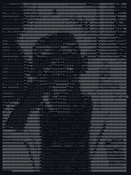

<div align="center">

```
███████╗██╗   ██╗██████╗ ██╗   ██╗ █████╗ ███╗   ██╗███████╗██╗  ██╗
██╔════╝██║   ██║██╔══██╗╚██╗ ██╔╝██╔══██╗████╗  ██║██╔════╝██║  ██║
███████╗██║   ██║██████╔╝ ╚████╔╝ ███████║██╔██╗ ██║███████╗███████║
╚════██║██║   ██║██╔══██╗  ╚██╔╝  ██╔══██║██║╚██╗██║╚════██║██╔══██║
███████║╚██████╔╝██║  ██║   ██║   ██║  ██║██║ ╚████║███████║██║  ██║
╚══════╝ ╚═════╝ ╚═╝  ╚═╝   ╚═╝   ╚═╝  ╚═╝╚═╝  ╚═══╝╚══════╝╚═╝  ╚═╝
```

</div>

<br>

<table>
<tr>
<td width="180" valign="top" align="center">



<br><br>

[](https://github.com/0xSRS)
[](https://www.linkedin.com/in/suryansh-raj-singh-20b9092b8/)
[](https://www.instagram.com/0x.srs/)

</td>
<td valign="top">


```
┌──(suryansh@0xSRS)-[~]
└─$ whoami --verbose
```

```
suryansh@nfsu-gandhinagar
──────────────────────────
OS       : National Forensic Sciences University (CSE)
Focus    : Cyber Security · Digital Forensics · AI/ML
Building : Netra — unified state CCTV integration
Shell    : python3 / bash
Status   : currently working on myself...
```

</td>
</tr>
</table>

<br>

### `> tech_stack --list`

<div align="center">


</div>

<br>

### `> git log --stats`

<div align="center">


</div>

<br>

### `> ls ./pinned`

<table>
<tr>
<td width="50%" valign="top">

**[Netra](https://github.com/0xSRS/Netra)**
Unified state CCTV integration — real-time vehicle & person recognition across a live camera network (plate/helmet detection, face-embedding search, GIS map).


</td>
<td width="50%" valign="top">

**[globe-trotter](https://github.com/0xSRS/globe-trotter)**
Full-stack travel planning platform with authenticated user accounts.


</td>
</tr>
</table>

<br>

```
> echo "thanks for stopping by" | lolcat --mono
```

<div align="center">
<sub>last compiled from the terminal of 0xSRS</sub>
</div>
